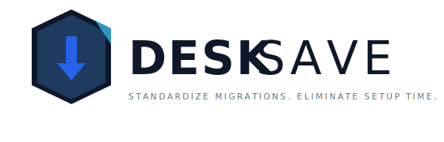
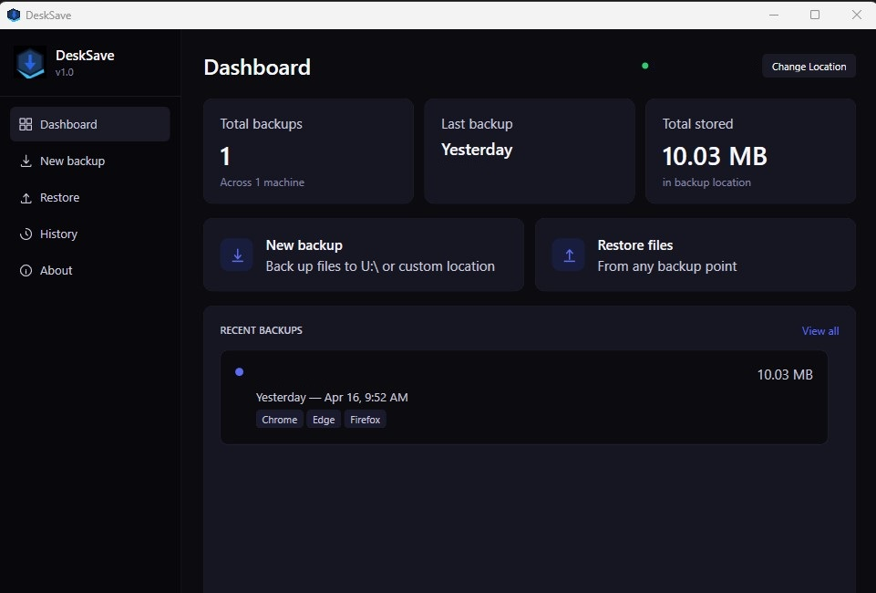
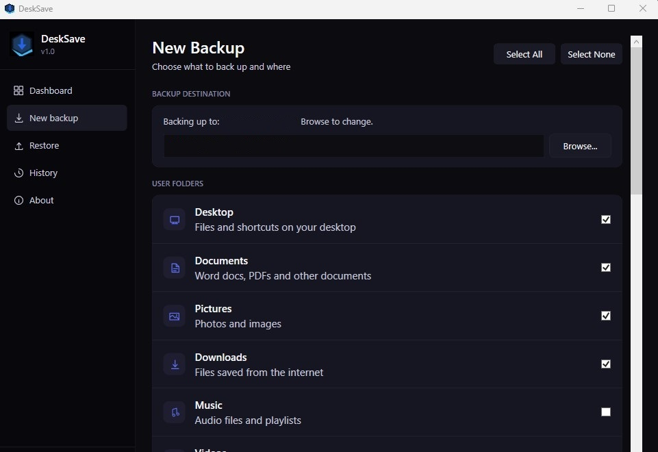
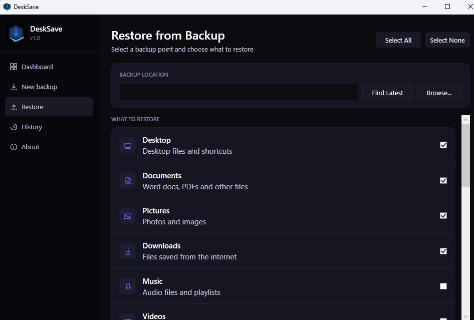

[](https://ko-fi.com/winklesit)


A free Windows tool for IT professionals & Users that backs up your personal files, browser bookmarks, printers, wallpaper, and app settings — then restores them on a new or rebuilt PC. No installation required.

---

## What it backs up

**Files** — Desktop, Documents, Pictures, Downloads, Music, Videos

**Browser bookmarks** — Chrome, Edge, and Firefox (all profiles)

**Network printers** — mapped printer connections

**Wallpaper** — your desktop image and display settings

**File associations** — which apps open which file types

**Password manager helper pages** — reminder links for Chrome and Edge export pages

You pick what you want. Nothing is selected without you knowing.

---

## Requirements

- Windows 10 or 11
- PowerShell 5.1 (already on every modern Windows machine)
- A place to save the backup — USB drive, external hard drive, NAS, or a network share

---

## How to run it

1. Download **DeskSave.exe**.
2. Double-click the file to launch the application.
3. If Windows SmartScreen appears, click More info and then **Run anyway**.
4. On first launch, click **Browse** (on the Backup tab) or **Change Location** (on the Dashboard) to choose where your backups get saved.
5. That folder is remembered for next time — you won't have to pick it again.

> If you're in a company environment with a mapped network drive (H:, N:, U:, Z:, etc.), DeskSave will detect it automatically and suggest it as the default location.

---

## First backup

1. Go to **New Backup** in the sidebar or the New Backup button on the dashboard
2. Check what you want to include
3. Hit **Start Backup**

That's it. Your files are copied to a folder named after your PC and the date, so you can have multiple backups over time and always know which is which.

---

## Screenshots





---

## Restoring

1. Go to **Restore** in the sidebar
2. Click **Find Latest Backup** — it'll pull up the most recent one automatically
3. Or click **Browse** to point it at any backup folder manually
4. Check what you want to restore and hit **Start Restore**

The History tab shows all your backups across every PC that's used the same backup location, with size info and what each backup contains.

---

## Where backups are saved

Backups go into a `_PCBackups` folder inside whatever location you choose. Each PC gets its own subfolder, and each backup run gets a timestamped folder inside that:

```
YourBackupDrive\
  _PCBackups\
    DESKTOP-ABC123\
      2025-06-01_10-30-AM\
      2025-07-15_02-15-PM\
    LAPTOP-XYZ\
      2025-07-20_09-00-AM\
```

---

## A few things worth knowing

**Browsers need to be closed before restoring bookmarks.** If Chrome, Edge, or Firefox is open when you restore, the bookmark file will be locked and the restore will fail. DeskSave will warn you about this.

**Windows Spotlight wallpapers can't be restored.** If your wallpaper was set to Windows Spotlight (the rotating lock screen images), DeskSave saves a note about it but can't copy the image. You'd just re-enable Spotlight manually after.

**File associations need a sign-out.** After restoring file associations, sign out and back in for all the changes to take effect.

**DeskSave writes a log.** If something goes wrong, there's a log file in `%TEMP%\BackupToolLogs` with details.

---

## Troubleshooting

**The window doesn't open or is blocked**
Since this is an unsigned executable, Windows might block it. Click More info on the blue SmartScreen popup and select Run anyway.

**Browser Passwords are not automatically backed up**
This is the intended design because of browser security. The application will open helper pages that allow you to quickly go to the export password page in the browser to allow your users to put in their passwords to manually backup. 

**Antivirus False Positives**
Some security software may flag compiled scripts. If this occurs, you can add an exclusion for DeskSave.exe or run the source code directly via PowerShell.

**Backup destination is empty or missing**
Click the Browse button on the Backup tab, or use the Change Location button on the Dashboard. DeskSave needs a save location before it can run.


---

## Feedback & Future Updates

This is version 1.0 and actively maintained. If you run into issues, 
have a feature request, or just want to share how it worked for you
open a GitHub Issue or reach out. I plan to keep improving DeskSave 
based on real user feedback.

***Feature improvement ideas**

**Backup additions:**

1. Outlook signatures
2. Sticky Notes
3. Custom fonts installed by the user
4. Taskbar layout — pinned apps &Start menu pins (Windows 11)


**UX improvements:**

1. A "Verify backup" button after completing a backup that spot-checks file counts and sizes match the source
2. Selective file restore: right now it's all files; allowing users to restore just specific subfolders e.g. only Documents\Work may be beneficial


---

## License

DeskSave is released under the **GNU General Public License v3 (GPL-3.0)**.

Copyright © 2026 Joshua Winkles

You're free to use, share, and modify it — but you can't sell it or repackage it as a paid product, and the original author credit must stay intact. Any modified versions you distribute must also be released under the same license. See the `LICENSE` file for full details.

> No warranties are provided. Always verify your backup works before you need it.
